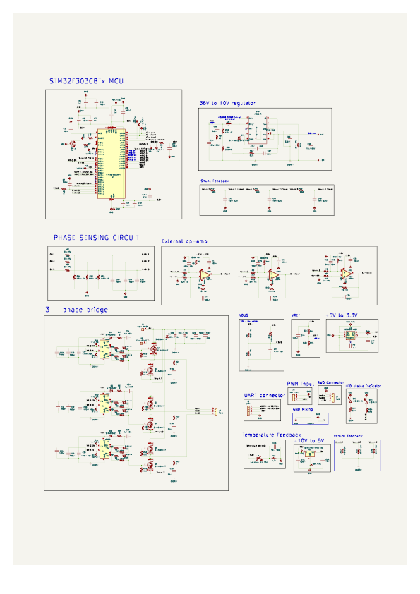

# ESC_30A
# Custom Electronic Speed Controller (ESC) Hardware

An open-source, high-performance Electronic Speed Controller (ESC) designed for brushless DC (BLDC) motor control. This repository contains the complete KiCad schematic. PCB layout design files, and production-ready manufacturing files are yet to be uploaded in future.

---

## 🚀 Features & Specifications

* **Microprocessor:** [STM32]
* **Gate Driver:** [e.g., DRV8302 / Dedicated discrete drivers]
* **Power MOSFETs:** [e.g., N-Channel 40V / 100A low $R_{DS(on)}$]
* **Supported Input Voltage:** `[e.g., 3S - 6S LiPo / 11.1V - 25.2V]`
* **Continuous Current:** `[e.g., 40A]` (with proper cooling)
* **Peak Current:** `[e.g., 60A]` (10 seconds)
* **Telemetry/Communication:** [e.g., PWM,UART]
* **Sensor Support:** [e.g., Sensorless / Hall Sensors / Inline Current Sensing]

---

## 📊 Circuit Preview

Below is the visual overview of the current hardware design.

### Schematic Preview

*Figure 1: Main control and power stage schematic layout.*

---
